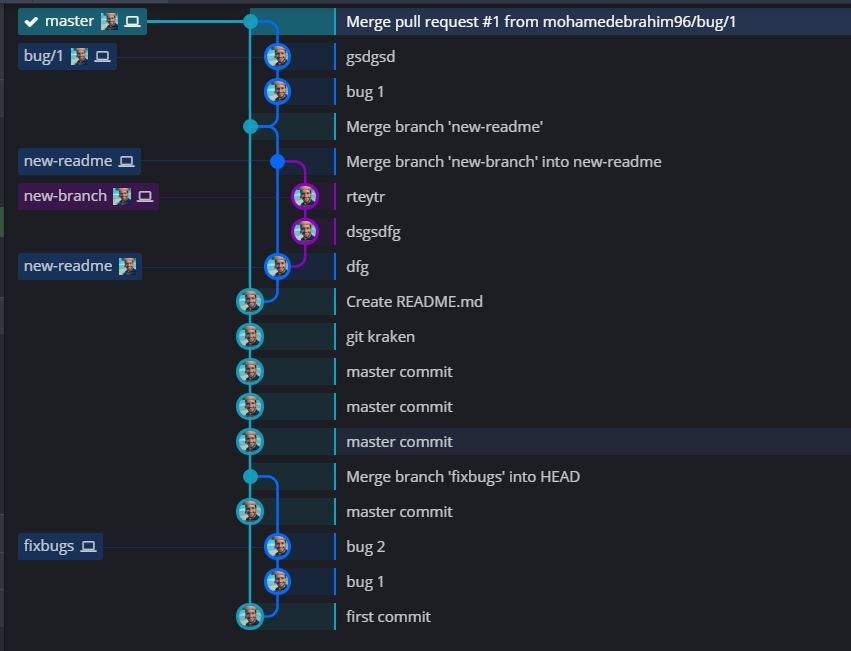

# Dagger-Kotlin-20line
[](https://www.codacy.com/app/maksim-m/Popular-Movies-App) [](https://opensource.org/licenses/MIT) [](https://opensource.org/licenses/MIT)   

Dagger 2 for Dummies in Kotlin (with 20 lines of code)

I am a dummy, and learning Dagger 2 is stretching my brain!! All tutorials I read introduced so many things to me at once e.g. Dependency Injection, Provider, Component, Module, Scope… my brain just exploded!!

Besides many tutorials are based on Java. Kotlin is the way of doing things today. It takes me months to digest Dagger 2 and had it done in Kotlin. So I vow to myself when I grab hold of it, I should create something really super simple one day, make this like ABC, for those out there like me looking for something like this.

To make it more fancier, I can change the Simple Hello World App to Simple Hello Dagger 2 App. Code as below (bold those I add on top of the template).
```
class MainActivity : AppCompatActivity() {

    val info = Info()

    override fun onCreate(savedInstanceState: Bundle?) {
        super.onCreate(savedInstanceState)
        setContentView(R.layout.activity_main)

        text_view.text = info.text

    }
}

class Info  {
    val text = "Hello Dagger 2"
}
```



******

License
-------

    Copyright 2018 mohamedebrahim96,Inc

    Licensed under the Apache License, Version 2.0 (the "License");
    you may not use this file except in compliance with the License.
    You may obtain a copy of the License at

       http://www.apache.org/licenses/LICENSE-2.0

    Unless required by applicable law or agreed to in writing, software
    distributed under the License is distributed on an "AS IS" BASIS,
    WITHOUT WARRANTIES OR CONDITIONS OF ANY KIND, either express or implied.
    See the License for the specific language governing permissions and
    limitations under the License.
